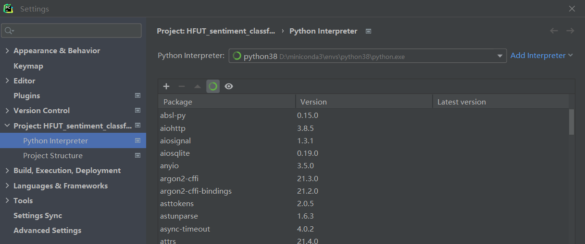
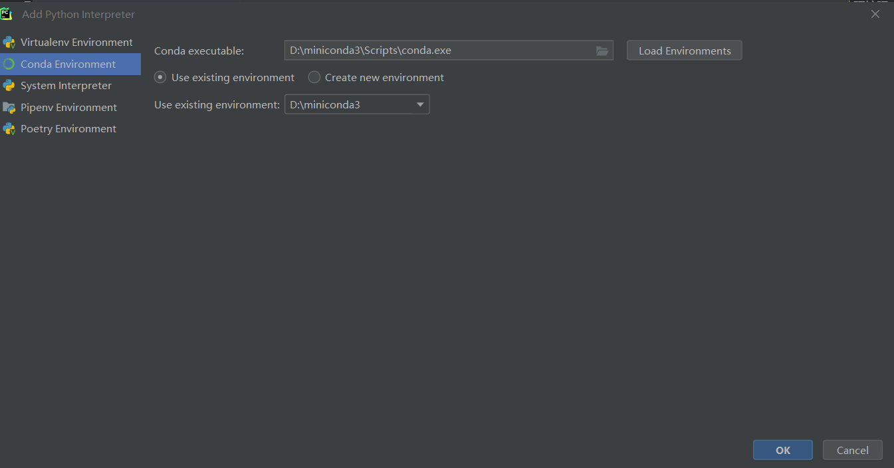
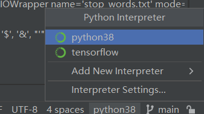

# 实验环境配置
## 一些概念
- python

Python是一种通用的、解释型、交互式、面向对象的编程语言。
- pycharm

PyCharm是一个用于Python开发的集成开发环境（IDE）。它提供了许多功能，如代码自动完成、项目导航、错误检查等，使Python开发更加高效和简单。
- conda

conda是一个开源的包管理系统和环境管理系统，可以用于安装多个版本的软件包以及其依赖，并能够在不同的版本之间轻松切换。
- anaconda

Anaconda是一个流行的Python和R的数据科学发行版。它包括了一系列预先安装的库和工具，特别适合数据分析、机器学习和科学计算。
- Jupyter Notebook

Jupyter Notebook是一个开源的Web应用程序，允许用户创建和共享包含实时代码、方程、可视化和叙述文本的文档。尤其在数据科学和机器学习领域，Jupyter Notebook是一个非常受欢迎的工具。

Jupyter Notebook 通常在Anaconda中预安装，因为它在数据科学社区中非常受欢迎。可以使用Conda命令轻松启动Jupyter Notebook。

## 安装步骤

1. 下载pycharm

如上所述，一个好的IDE可以极大的提高开发效率。

最简单的例子，我们在打import xxx包时，如果直接用python自带的IDE开发，需要自己打出正确的单词，并且当你打错了并不会及时报错，在运行时才发现报错。

python公认好用的IDE之一为Pycharm，

这是 [pycharm下载网址](https://www.jetbrains.com/pycharm/download/)。
选择professional版本（即付费版,学生可以免费使用）进行下载

2. 下载miniconda

Miniconda是一款小巧的python环境管理工具，安装包大约只有50M多点，其安装程序中包含conda软件包管理器和Python。一旦安装了Miniconda，就可以使用conda命令安装任何其他软件工具包并创建环境等。

这一步骤也可以下载anaconda，但其大小有10+G

下载地址[miniconda下载网址](https://docs.conda.io/en/latest/miniconda.html)。
在cmd中输入conda -V，若显示conda版本则代表安装完成。

找到anaconda prompt就可以配置环境了！

3. 使用conda配置环境

打开anaconda prompt
输入

`` prompt
conda create -n your_env_name python=x.x
``

anaconda命令创建python版本为x.x，名字为your_env_name的虚拟环境。your_env_name文件可以在Anaconda安装目录envs文件下找到。

接着输入

``
conda activate your_env_name
``

就可以激活这个环境。之后下载库什么的，比如下载pandas

``
conda install pandas
``

下载jupyter notebook

``
conda install jupyter notebook
``

在之后，若代码运行报错为"No module named xxx"，只需要打开prompt，输入激活环境的语句，再
``
conda install xxx
``

4. pycharm add conda环境
在编写代码时，打开的是pycharm，那么pycharm如何接入conda创建的环境呢。

点击File-->settings-->project-->python interpreter-->add interpreter

在conda executable处选中下载的conda.exe(找到自己电脑miniconda安装位置，conda.exe在Scripts文件夹下)

点击load Environments就可以把conda创建的环境导入，比如在先前我们创建了一个名为“your_env_name”的环境，在Use existing environment处选中your_env_name，最后点击OK即可。

在pycharm右下角可以切换环境

